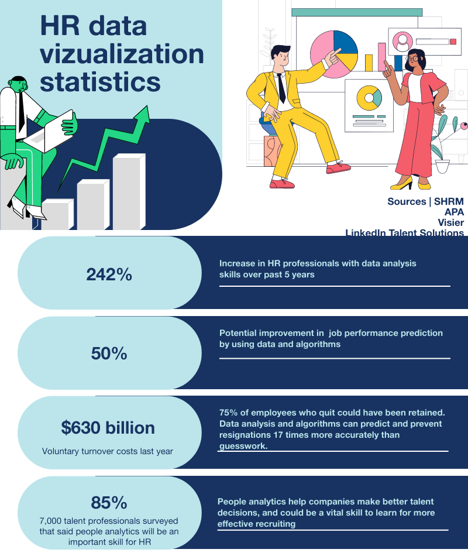

# Key Principles

Nama : Nawwaf Abdurrahman   
NIM  : 122450018  
Kelas: RC 

**Deskripsi Tugas**  

Berdasarkan pada prinsip-prinsip (4 prinsip) dalam pengembangan visualisasi data, 
maka: cari bentuk/contoh visualisais yang termasuk dalam Bad dan Good category visualisasi  (masing-masing 2 contoh) dan berikan alasan berdasarkan 4 prinsip mengapa masuk dalam Bad dan Good visualisasi.

**Contoh Poster**   
Poster 1 Tidak Bagus  
    

Poster 2 Bagus  
  

**Deskripsi Poster**

Poster 1 merupakan poster yang menampilkan tentang Human Resources yang bersumber dari https://piktochart.com/id/blog/data-visualisasi-statistik/  

Sedangkan Poster 2 adalah poster yang menampilkan tentang Korupsi yang ada di Indonesia yang didapatkan dari https://dhonyfirmansyah.com/beda-visualisasi-data-dan-infografis/ 

**Prinsip 1 : Strive for form & Function**  
Poster 1 telah memenuhi prinsip pertama (Strive for Form & Function) karena data yang divisualisasikan sudah sesuai dengan ilustrasi dan fungsi dari pembuatan poster. Ilustrasi seorang pria dengan memegang laptop serta 2 orang yang sedang berdiskusi tentang profil seseorang sudah cukup untuk menyimpulkan bahwasanya poster ini memenuhi prinsip pertama.   

Poster 2 juga telah memenuhi prinsip pertama (Strive for Form & Function). Ilustrasi seseorang perut buncit yang sedang tertidur dengan bergelimpangan uang serta 3 orang pria dengan masing-masing seragamnya merepresentasikan institusi yang ada di Indonesia. Sehingga poster ke-2 adalah poster yang memenuhi prinsip pertama. 

**Prinsip 2 : Justifying selection of everything we do**  
Prinsip kedua menjelaskan tentang semua bentuk visual yang ditampilkan mempunyai makna atau tujuan untuk mengomunikasikan dan tidak asal-asalan.   

Pada Poster pertama, Visualisasi yang terdapat pada poster tidak mencantumkan properti yang biasa digunakan untuk mengomunikasikan data seperti piechart,barchart,histogram, dan lain-lain. Serta penjelasan yang terlalu singkat sehingga pembaca tidak betul-betul bisa mengilustrasikan data sehingga poster pertama tidak memenuhi prinsip kedua.   

Sedangkan pada poster kedua, terdapat berbagai macam properti yang digunakan seperti Barchart dan Piechart yang digunakan untuk memberikan Gambaran kepada pembaca sebagai bentuk komunikasi. Sehingga poster kedua memenuhi prinsip yang kedua.  

**Prinsip 3: Creating Accessibility Through Intuitive Design**  
Prinsip ketiga adalah tentang Design yang indah namun tidak memerlukan waktu yang banyak bagi pembaca untuk mengartikan data yang disajikan dalam design tersebut.  

Poster pertama memiliki design yang bisa dibilang tidak memiliki nilai aesthetic namun pembaca masih bisa memahami data yang terdapat pada poster pertama walaupun hanya berdasarkan teks saja. Sehingga poster pertama tidak memenuhi prinsip ketiga.  

Poster kedua memiliki design yang menarik, karena pemilihan warna yang digunakan pada poster tersebut selaras, serta headline yang digunakan dengan jelas menegaskan potensi kerugian negara yang disebabkan oleh korupsi serta penempatan komponen yang simetris. Sehingga poster kedua memenuhi prinsip yang ketiga  

**Prinsip 4: Never Deceive the Receiver**  
Prinsip ketiga menjelaskan tentang etika dalam visualisasi data yaitu tidak menipu pembaca dan memilih bentuk visual yang tidak rancu yang dapat dilihat oleh mata. 

Poster pertama tidak memiliki bentuk visual dari data yang ingin divisualisasikan hanya terdapat teks yang menjelaskan tentang angka dan tidak menampilkan total data yang digunakan pada poster. Sehingga poster pertama tidak memenuhi prinsip keempat. 

Poster kedua memiliki bentuk visual yang baik. Semua data yang disajikan tidak meggunakan bentuk visual yang rancu. Pemilihan visualisasi data Barchart merepresentasikan angka korupsi pada setiap tahunnya di masing-masing institusi. Sehingga poster kedua memenuhi prinsip yang keempat.

